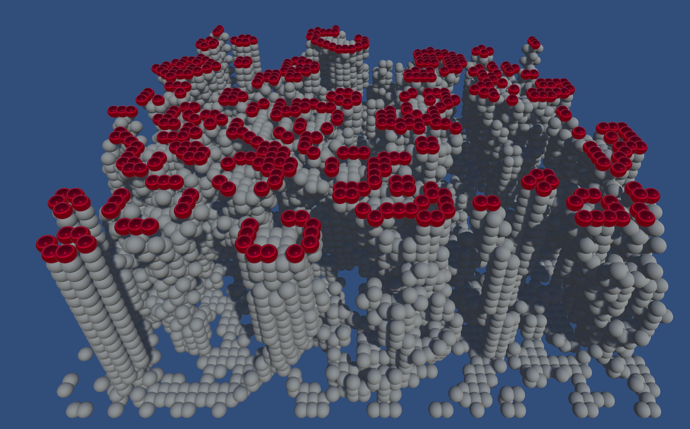

# Automata
 Game of Life stacked 

A tribute to John Conway who passed away on 2020-04-11 from COVID-19. He became 82 years old. John Conway is the inventor of cellular automatas and in particular the Game of Life which happens to be one of the first animations I implemented in the 80:s. 

[ Video](https://www.youtube.com/watch?v=O7mZFoLty7k)

This project is heavily based on this project: [Extruded Game Of Life](https://github.com/keenanwoodall/ExtrudedGameOfLife)

The project is done in Unity. Press 'r' to reset animation and change color and press 'q' to quit. 

/Peter Parnes
peter@parnes.com
